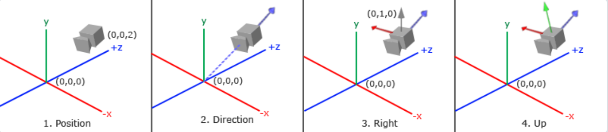
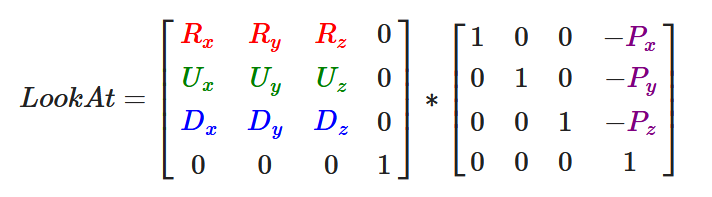

### 使用到的OpenGL高级功能

#### Assimp

当使用Assimp库导入一个模型的时候，它会将整个模型加载进一个**场景(Scene)**对象，它包含导入的模型/场景中的所有数据。Assimp会将场景载入为一系列的**节点(Node)**，每个节点包含了场景对象中所储存数据的索引，每个节点都可以有任意数量的子节点。

这些节点有一系列指向**场景**对象中mMeshes数组中储存的网格数据的索引。Scene下的mMeshes数组储存了**真正的Mesh对象**。

一个Mesh对象本身包含了渲染所需要的所有相关数据，像是顶点位置、法向量、纹理坐标、面(Face)和物体的材质。分别对这些**Mesh对象**进行渲染，最终得到一系列的网格数据，将它们包含在一个**Model对象**中，即完成了对象导入。

#### 深度测试

使用深度缓冲来防止3D为物体面的前后关系错乱。深度缓冲会存储每个片段的信息，以16、24或32位float的形式储存它的深度值。深度测试被启用时，OpenGL会将一个片段的深度值与深度缓冲中的内容进行比较，取较大值，并对深度缓冲进行更新，较小值（片段）被丢弃。具体体现为：每个片段的深度值都位于[0,1]范围之中（或者被线性变换到[0,1]之间），系统通过比较深度缓冲中深度值的大小和物体z值大小来判断片段的远近，并更新深度缓冲。

```c++
glEnable(GL_DEPTH_TEST)
```

启用深度测试，启用后会对每一个片段的深度进行比较，并取较大值进行更新，较小值丢弃。

```c++
glClear(GL_COLOR_BUFFER_BIT | GL_DEPTH_BUFFER_BIT)
```

清空深度缓冲。在每一轮渲染之前应该清空深度缓冲进行更新。

```C++
glDepthFunc(GL_LESS);
```

深度测试函数，用于是我们能够控制何时通过或丢弃片段，何时取更新深度缓冲。

深度冲突：当物体靠的过近时，由于深度测试，会表现出视野中紧贴的两个面不断切换的情况。应该避免两个物体的面重合。

#### 混合

混合用于实现物体的透明度，例如透过一块红色的玻璃去观察后面的物体，此时物体的颜色就为红色与它原本颜色的混合色。

alpha值：Alpha颜色值是颜色向量的第四个分量。1.0时物体完全不透明，0.0时物体将会是完全透明的。当alpha值为0.5时，物体的颜色有50%是来自物体自身的颜色，50%来自背后物体的颜色。

```c++
glTexImage2D(GL_TEXTURE_2D, 0, GL_RGBA, width, height, 0, GL_RGBA, GL_UNSIGNED_BYTE, data);
```

此函数中在纹理加载时使用了alpha通道，用于之后设置透明度。

```c++
void main()
{             
    vec4 texColor = texture(texture1, TexCoords);
    if(texColor.a < 0.1)
        discard;
    FragColor = texColor;
}
```

加载物体纹理时，需要在片段着色器中对alpha通道的值进行判断。当采样的纹理颜色小于0.1时，丢弃该片段，以此实现只显示想要的部分纹理，而其余部分透明。

```c++
glEnable(GL_BLEND)
```

启用颜色混合

```c++
glBlendFunc(GL_SRC_ALPHA, GL_ONE_MINUS_SRC_ALPHA)
```

颜色混合函数。第一项为第一个物体颜色的alpha通道值，第二项为另一个物体颜色的alpha通道值，二者和为1。即此函数设置了物体颜色混合时每部分的占比。

在使用**混合**时要注意**深度测试**（一般情况时应该从远到近依次渲染），否则深度测试会优先执行，在设置物体透明度后，还是会因为深度测试看不到后面的物体。

#### 面剔除

```c++
glEnable(GL_CULL_FACE);
```

启用面剔除，检查所有面向观察者的面进行渲染，丢弃那些背向的面，节省片段着色器调用开销。

方法：检测顶点环绕顺序。我们首先为三角形的顶点标号（1，2，3），以设置环绕顺序。当检测到观察者视角中该面中的点为顺时针环绕时，判断为正面并进行渲染；检测到为逆时针时，判断为背面并丢弃。

#### 立方体贴图

立方体贴图是一个包含了6个2D纹理的纹理，每个2D纹理都组成了立方体的一个面，是一张完整的纹理。

```c++
unsigned int textureID;
glGenTextures(1, &textureID);
glBindTexture(GL_TEXTURE_CUBE_MAP, textureID);
```

定义一个表示纹理ID的变量，并生成一个纹理，通过**glBindTexture**将纹理绑定到目标上

##### 天空盒

天空盒贴图与一般的立方体贴图相同，但需要注意天空盒包裹在最外层，所以应该移除该立方体的全部位移。

```c++
glm::mat4 view = glm::mat4(glm::mat3(camera.GetViewMatrix()))
```

我们通过取4x4矩阵左上角的3x3矩阵来移除变换矩阵的位移部分，我们可以将观察矩阵转换为3x3矩阵（移除位移），再将其转换回4x4矩阵。通过以上代码，我们只保留了天空盒的旋转变换，实现了天空盒效果。

##### 环境映射

**反射**

根据观察方向向量***I***和物体的法向量***N***，来计算反射向量***R***。我们使用GLSL内建的**reflect**函数来计算这个反射向量。我们以***R***向量作为索引向量来对天空盒贴图进行采样，返回环境的颜色值。最终的结果是物体看起来反射了天空盒。片段着色器部分入下：

```C++
void main()
{             
    vec3 I = normalize(Position - cameraPos);
    vec3 R = reflect(I, normalize(Normal));
    FragColor = vec4(texture(skybox, R).rgb, 1.0);
}
```

**折射**

根据观察方向向量***I***和物体的法向量***N***，来计算反射向量***R‘***，我们使用GLSL内建的**refract**函数来计算这个折射向量。后续取样操作与反射贴图相同。

```c++
void main()
{             
    float ratio = 1.00 / 1.52;
    vec3 I = normalize(Position - cameraPos);
    vec3 R = refract(I, normalize(Normal), ratio);
    FragColor = vec4(texture(skybox, R).rgb, 1.0);
}
```


### OpenGL项目实现

**简述：**本项目是基于OpenGL完成的，使用了OpenGL提供的Assimp库、glad库以及glfw库。项目中主要包含了3D物体的绘制（天空盒、带有纹理的物体、折射材质的物体、反射材质的物体），光照的实现（多光源的叠加、不同光源的影响（环境光、点光源、平行光、汇聚光等），物体材质对反射光的影响），物体对天空盒的反射、折射以及模型的导入等。本项目意在与js实现的软光栅项目进行对比，观察两个项目实现相同场景时性能的优劣，以及使用同一技术时方法的区别。

#### 工具类的定义

##### 着色器类

```c++
#ifndef SHADER_H
#define SHADER_H

#include <glad/glad.h>; 

#include <string>
#include <fstream>
#include <sstream>
#include <iostream>


class Shader
{
public:
    // 程序ID
    unsigned int ID;

    // 构造器读取并构建着色器
    Shader(const GLchar* vertexPath, const GLchar* fragmentPath);
    // 使用/激活程序
    void use();
    // uniform工具函数
    void setBool(const std::string &name, bool value) const;  
    void setInt(const std::string &name, int value) const;   
    void setFloat(const std::string &name, float value) const;
};

#endif
```

通过定义着色器类Shade来简化我们着色器的使用，让我们在使用着色器时不需要再直接调用OpenGL提供的库函数，而是用我们自己编写的封装好的函数。编写、编译、管理着色器是件麻烦的事情，所以我们写一个类来简化操作。它可以从硬盘读取着色器，然后编译并链接它们，并对它们进行错误检测，这就变得很好用了。这也会让你了解该如何封装目前所学的知识到一个抽象对象中。

```c++
 // 构造器读取并构建着色器
 Shader(const char* vertexPath, const char* fragmentPath, const char* geometryPath=nullptr);
 // 使用/激活程序
 void use();
```

着色器类储存了着色器程序的ID。它的构造器需要顶点和片段着色器源代码的文件路径，这样我们就可以把源码的文本文件储存在硬盘上了。除此之外，为了让我们的生活更轻松一点，还加入了一些工具函数：use用来激活着色器程序，所有的set…函数能够查询一个unform的位置值并设置它的值。

##### 摄像机类

```C++
class Camera
{
public:
    // camera Attributes
    glm::vec3 Position;//摄像机位置向量
    glm::vec3 Front;//指向摄像机目标的向量
    glm::vec3 Up;//摄像机上向量
    glm::vec3 Right;//摄像机右向量
    glm::vec3 WorldUp;//世界坐标下正上向量
    // euler Angles
    float Yaw;
    float Pitch;
    // camera options
    float MovementSpeed;
    float MouseSensitivity;
    float Zoom;
```

观察矩阵把所有的世界坐标变换为相对于摄像机位置与方向的观察坐标。要定义一个摄像机，我们需要它在世界空间中的位置、观察的方向、一个指向它右测的向量以及一个指向它上方的向量。细心的读者可能已经注意到我们实际上创建了一个三个单位轴相互垂直的、以摄像机的位置为原点的坐标系。

**摄像机位置：**获取摄像机位置很简单。摄像机位置简单来说就是世界空间中一个指向摄像机位置的向量。我们把摄像机位置设置为上一节中的那个相同的位置：

```c++
glm::vec3 cameraPos = glm::vec3(0.0f, 0.0f, 3.0f);
```

**摄像机方向：**下一个需要的向量是摄像机的方向，这里指的是摄像机指向哪个方向。现在我们让摄像机指向场景原点：(0, 0, 0)。还记得如果将两个矢量相减，我们就能得到这两个矢量的差吗？用场景原点向量减去摄像机位置向量的结果就是摄像机的指向向量。由于我们知道摄像机指向z轴负方向，但我们希望方向向量(Direction Vector)指向摄像机的z轴正方向。如果我们交换相减的顺序，我们就会获得一个指向摄像机正z轴方向的向量。

```c++
glm::vec3 cameraTarget = glm::vec3(0.0f, 0.0f, 0.0f);
glm::vec3 cameraDirection = glm::normalize(cameraPos - cameraTarget);
```

**右轴：**我们需要的另一个向量是一个右向量，它代表摄像机空间的x轴的正方向。为获取右向量我们需要先使用一个小技巧：先定义一个上向量。接下来把上向量和第二步得到的方向向量进行叉乘。两个向量叉乘的结果会同时垂直于两向量，因此我们会得到指向x轴正方向的那个向量（如果我们交换两个向量叉乘的顺序就会得到相反的指向x轴负方向的向量）：

```C++
glm::vec3 up = glm::vec3(0.0f, 1.0f, 0.0f); 
glm::vec3 cameraRight = glm::normalize(glm::cross(up, cameraDirection));
```

**上轴：**现在我们已经有了x轴向量和z轴向量，获取一个指向摄像机的正y轴向量就相对简单了：我们把右向量和方向向量进行叉乘：

```c++
glm::vec3 cameraUp = glm::cross(cameraDirection, cameraRight);
```



**LookAt矩阵：**使用矩阵的好处之一是如果你使用3个相互垂直（或非线性）的轴定义了一个坐标空间，我们可以用这3个轴外加一个平移向量来创建一个矩阵，并且我们可以用这个矩阵乘以任何向量来将其变换到那个坐标空间。这正是**LookAt**矩阵所做的，现在我们有了3个相互垂直的轴和一个定义摄像机空间的位置坐标，我们可以创建我们自己的LookAt矩阵了。



```c++
glm::mat4 view;
view = glm::lookAt(glm::vec3(0.0f, 0.0f, 3.0f), 
           glm::vec3(0.0f, 0.0f, 0.0f), 
           glm::vec3(0.0f, 1.0f, 0.0f));
```

其中R是右向量，U是上向量，D是方向向量P是摄像机位置向量。注意，位置向量是相反的，因为我们最终希望把世界平移到与我们自身移动的相反方向。把这个LookAt矩阵作为观察矩阵可以很高效地把所有世界坐标变换到刚刚定义的观察空间。LookAt矩阵就像它的名字表达的那样：它会创建一个看着(Look at)给定目标的观察矩阵。

**自由移动：**

```C++
void ProcessKeyboard(Camera_Movement direction, float deltaTime)
    {
        float velocity = MovementSpeed * deltaTime;
        if (direction == FORWARD)
            Position += Front * velocity;
        if (direction == BACKWARD)
            Position -= Front * velocity;
        if (direction == LEFT)
            Position -= Right * velocity;
        if (direction == RIGHT)
            Position += Right * velocity;
    }
```

定义函数来监测用户按下的按键。我们监测上、下、左、右四个按键，通过按键的时间长短和按键来计算世界坐标与我们（摄像机）位置的偏移量，并对世界坐标进行反向平移，以此实现我们正向移动的效果。

**视角移动：**欧拉角(Euler Angle)是可以表示3D空间中任何旋转的3个值，由莱昂哈德·欧拉(Leonhard Euler)在18世纪提出。一共有3种欧拉角：俯仰角(Pitch)、偏航角(Yaw)和滚转角(Roll)，我们通过欧拉角来计算视角的移动。

俯仰角是描述我们如何往上或往下看的角，偏航角表示我们往左和往右看的程度。滚转角代表我们如何**翻滚**摄像机。每个欧拉角都有一个值来表示，把三个角结合起来我们就能够计算3D空间中任何的旋转向量了。

```C++
direction.x = cos(glm::radians(pitch)) * cos(glm::radians(yaw)); 
direction.y = sin(glm::radians(pitch));
direction.z = cos(glm::radians(pitch)) * sin(glm::radians(yaw));
```

**鼠标输入：**偏航角和俯仰角是通过鼠标（或手柄）移动获得的，水平的移动影响偏航角，竖直的移动影响俯仰角。它的原理就是，储存上一帧鼠标的位置，在当前帧中我们当前计算鼠标位置与上一帧的位置相差多少。如果水平/竖直差别越大那么俯仰角或偏航角就改变越大，也就是摄像机需要移动更多的距离。

```c++
glfwSetInputMode(window, GLFW_CURSOR, GLFW_CURSOR_DISABLED);
```

我们创建的摄像机系统是一个FPS风格的摄像机，它能够满足大多数情况需要，而且与欧拉角兼容。但是，这个FPS摄像机不允许俯仰角大于90度，而且我们使用了一个固定的上向量(0, 1, 0)。

#### 代码实现

##### 全局变量的定义

```C++
void framebuffer_size_callback(GLFWwindow* window, int width, int height);
void mouse_callback(GLFWwindow* window, double xpos, double ypos);
void scroll_callback(GLFWwindow* window, double xoffset, double yoffset);
void processInput(GLFWwindow* window);
unsigned int loadTexture(const char* path);
unsigned int loadCubemap(vector<std::string> faces);

// 窗口设置
const unsigned int SCR_WIDTH = 1600;
const unsigned int SCR_HEIGHT = 1000;

// 摄像机
Camera camera(glm::vec3(0.0f, 0.0f, 3.0f));
float lastX = SCR_WIDTH / 2.0f;
float lastY = SCR_HEIGHT / 2.0f;
bool firstMouse = true;

// 间隔时间
float deltaTime = 0.0f;
float lastFrame = 0.0f;

// 光照
glm::vec3 lightPos(1.2f, 1.0f, 2.0f);
```

我们定义了程序运行时的窗口大小，创建了一个摄像机对象来代表我们的位置和视野方向。并且记录项目执行时鼠标的位置。其中，我们将firstMouse设置为true，来保证我们刚开始进入程序时，界面不会因为鼠标的突然移进而跳变。

定义间隔时间，来监测按键按下的时间，以此来计算移动距离的长短。

lightPos为光源向量，用来记录光源的世界坐标。

```c++
int main()
{
    // 初始化设置
    glfwInit();
    glfwWindowHint(GLFW_CONTEXT_VERSION_MAJOR, 3);
    glfwWindowHint(GLFW_CONTEXT_VERSION_MINOR, 3);
    glfwWindowHint(GLFW_OPENGL_PROFILE, GLFW_OPENGL_CORE_PROFILE);
```

首先，我们在main函数中调用glfwInit函数来初始化GLFW，然后我们可以使用glfwWindowHint函数来配置GLFW。glfwWindowHint函数的第一个参数代表选项的名称，我们可以从很多以`GLFW_`开头的枚举值中选择；第二个参数接受一个整型，用来设置这个选项的值。

```c++
// 创建窗口
    GLFWwindow* window = glfwCreateWindow(SCR_WIDTH, SCR_HEIGHT, "LearnOpenGL", NULL, NULL);
    if (window == NULL)
    {
        std::cout << "Failed to create GLFW window" << std::endl;
        glfwTerminate();
        return -1;
    }
```

创建窗口，若创建失败则对用户进行提示。glfwCreateWindow函数需要窗口的宽和高作为它的前两个参数。第三个参数表示这个窗口的名称（标题）。这个函数将会返回一个GLFWwindow对象，我们会在其它的GLFW操作中使用到。创建完窗口我们就可以通知GLFW将我们窗口的上下文设置为当前线程的主上下文了。

```c++
//捕捉鼠标
    glfwSetInputMode(window, GLFW_CURSOR, GLFW_CURSOR_DISABLED);

    // 加载GLAD
    if (!gladLoadGLLoader((GLADloadproc)glfwGetProcAddress))
    {
        std::cout << "Failed to initialize GLAD" << std::endl;
        return -1;
    }

    // 开启深度测试
    glEnable(GL_DEPTH_TEST);
```

调用函数加载GLAD，并开启深度测试，保证图形在渲染时拥有正确前后关系。

```C++
// 绑定着色器
    // ------------------------------------
    Shader lightingShader("5.2.light_casters.vs", "5.2.light_casters.fs");
    Shader WallShader("5.2.light_casters.vs", "5.2.light_casters.fs");
    Shader MaterialShader("material.vs", "material.fs");
    Shader lightCubeShader("5.2.light_cube.vs", "5.2.light_cube.fs");
    Shader reflectcubeshader("6.2.cubemaps.vs", "6.2.cubemaps.fs");
    Shader reflactcubeshader("6.2.cubemaps.vs", "reflaction.fs");
    Shader skyboxShader("6.2.skybox.vs", "6.2.skybox.fs");
```

创建着色器对象并绑定对应的顶点着色器和片段着色器。其中lightingShader反光木箱着色器，WallShader为反光砖纹着色器，MaterialShader为材质物体着色器，lightCubeShader为光源方块着色器，reflectcubeshader为反射材质物体着色器，reflactcubeshader为折射材质物体着色器，skyboxShader为天空盒着色器。

```c++
// 设置顶点矩阵
    // ------------------------------------------------------------------
    float vertices[] = {//贴图物体顶点矩阵
        // positions          // normals           // texture coords
        -0.5f, -0.5f, -0.5f,  0.0f,  0.0f, -1.0f,  0.0f,  0.0f,
         0.5f, -0.5f, -0.5f,  0.0f,  0.0f, -1.0f,  1.0f,  0.0f,
         0.5f,  0.5f, -0.5f,  0.0f,  0.0f, -1.0f,  1.0f,  1.0f,
         0.5f,  0.5f, -0.5f,  0.0f,  0.0f, -1.0f,  1.0f,  1.0f,
        -0.5f,  0.5f, -0.5f,  0.0f,  0.0f, -1.0f,  0.0f,  1.0f,
        -0.5f, -0.5f, -0.5f,  0.0f,  0.0f, -1.0f,  0.0f,  0.0f,
        ...
    };

    float cubeVertices[] = {//反射物体顶点矩阵
        // positions          // normals
        -0.5f, -0.5f, -0.5f,  0.0f,  0.0f, -1.0f,
         0.5f, -0.5f, -0.5f,  0.0f,  0.0f, -1.0f,
         0.5f,  0.5f, -0.5f,  0.0f,  0.0f, -1.0f,
         0.5f,  0.5f, -0.5f,  0.0f,  0.0f, -1.0f,
        -0.5f,  0.5f, -0.5f,  0.0f,  0.0f, -1.0f,
        -0.5f, -0.5f, -0.5f,  0.0f,  0.0f, -1.0f,
        ...
    };

    //天空盒坐标
    float skyboxVertices[] = {
        // positions          
        -1.0f,  1.0f, -1.0f,
        -1.0f, -1.0f, -1.0f,
         1.0f, -1.0f, -1.0f,
         1.0f, -1.0f, -1.0f,
         1.0f,  1.0f, -1.0f,
        -1.0f,  1.0f, -1.0f,
        ...
    };
```

我们定义三种类型的矩阵来表示三种不同的物体，根据它们顶点坐标的不同，可以看出它们大小、参数的不同。

```
    // 物体位置
    glm::vec3 cubePositions[] = {
        glm::vec3(2.0f,  5.0f, -15.0f),
        glm::vec3(-1.5f, -2.2f, -2.5f),
        glm::vec3(-3.8f, -2.0f, -12.3f),
        glm::vec3(2.4f, -0.4f, -3.5f),
        glm::vec3(-1.7f,  3.0f, -7.5f),
        glm::vec3(1.3f, -2.0f, -2.5f),
        glm::vec3(1.5f,  2.0f, -2.5f),
        glm::vec3(1.5f,  0.2f, -1.5f),
        glm::vec3(-1.3f,  1.0f, -1.5f),
        glm::vec3(2.0f, 2.0f, -12.0f)
    };
    // 多个点光源
    glm::vec3 pointLightPositions[] = {
        glm::vec3(0.7f,  0.2f,  2.0f),
        glm::vec3(2.3f, -3.3f, -4.0f),
        glm::vec3(-4.0f,  2.0f, -12.0f),
        glm::vec3(0.0f,  0.0f, -3.0f)
    };
```

我们定义两种类型的位置数组，上面的数组为物体的位置数组，数组的每一项记录了一个物体在世界坐标中的位置。第二个数组为光源位置数组，数组中的每一项对应一个光源在世界坐标中的位置。

```C++
// 设置物体的VAO和VBO
    unsigned int VBO, cubeVAO;
    glGenVertexArrays(1, &cubeVAO);
    glGenBuffers(1, &VBO);

    glBindBuffer(GL_ARRAY_BUFFER, VBO);
    glBufferData(GL_ARRAY_BUFFER, sizeof(vertices), vertices, GL_STATIC_DRAW);

    glBindVertexArray(cubeVAO);
    glVertexAttribPointer(0, 3, GL_FLOAT, GL_FALSE, 8 * sizeof(float), (void*)0);
    glEnableVertexAttribArray(0);
    glVertexAttribPointer(1, 3, GL_FLOAT, GL_FALSE, 8 * sizeof(float), (void*)(3 * sizeof(float)));
    glEnableVertexAttribArray(1);
    glVertexAttribPointer(2, 2, GL_FLOAT, GL_FALSE, 8 * sizeof(float), (void*)(6 * sizeof(float)));
    glEnableVertexAttribArray(2);

    // 设置点光源的VAO和VBO
    unsigned int lightCubeVAO;
    glGenVertexArrays(1, &lightCubeVAO);
    glBindVertexArray(lightCubeVAO);

    glBindBuffer(GL_ARRAY_BUFFER, VBO);
    // 更新位置信息来更新容器
    glVertexAttribPointer(0, 3, GL_FLOAT, GL_FALSE, 8 * sizeof(float), (void*)0);
    glEnableVertexAttribArray(0);
```

我们定义缓冲对象来存储顶点矩阵，通过特定对象的绑定与解绑，来实现自由绘制。

我们通过顶点缓冲对象(Vertex Buffer Objects, VBO)管理这个内存，它会在GPU内存（通常被称为显存）中储存大量顶点。使用这些缓冲对象的好处是我们可以一次性的发送一大批数据到显卡上，而不是每个顶点发送一次。从CPU把数据发送到显卡相对较慢，所以只要可能我们都要尝试尽量一次性发送尽可能多的数据。当数据发送至显卡的内存中后，顶点着色器几乎能立即访问顶点，这是个非常快的过程。

顶点数组对象(Vertex Array Object, VAO)可以像顶点缓冲对象那样被绑定，任何随后的顶点属性调用都会储存在这个VAO中。这样的好处就是，当配置顶点属性指针时，你只需要将那些调用执行一次，之后再绘制物体的时候只需要绑定相应的VAO就行了。这使在不同顶点数据和属性配置之间切换变得非常简单，只需要绑定不同的VAO就行了。

```c++
// 加载纹理
// -----------------------------------------------------------------------------
    unsigned int diffuseMap = loadTexture("source/container2.png");
    unsigned int specularMap = loadTexture("source/container2_specular.png");
    unsigned int diffuseMap2 = loadTexture("source/wall2.bmp");
```

使用loadTexture函数来加载文件中的纹理数据

```C++
unsigned int loadTexture(char const* path)
{
    unsigned int textureID;
    glGenTextures(1, &textureID);

    int width, height, nrComponents;
    unsigned char* data = stbi_load(path, &width, &height, &nrComponents, 0);
    if (data)
    {
        GLenum format;
        if (nrComponents == 1)
            format = GL_RED;
        else if (nrComponents == 3)
            format = GL_RGB;
        else if (nrComponents == 4)
            format = GL_RGBA;

        glBindTexture(GL_TEXTURE_2D, textureID);
        glTexImage2D(GL_TEXTURE_2D, 0, format, width, height, 0, format, GL_UNSIGNED_BYTE, data);
        glGenerateMipmap(GL_TEXTURE_2D);

        glTexParameteri(GL_TEXTURE_2D, GL_TEXTURE_WRAP_S, GL_REPEAT);
        glTexParameteri(GL_TEXTURE_2D, GL_TEXTURE_WRAP_T, GL_REPEAT);
        glTexParameteri(GL_TEXTURE_2D, GL_TEXTURE_MIN_FILTER, GL_LINEAR_MIPMAP_LINEAR);
        glTexParameteri(GL_TEXTURE_2D, GL_TEXTURE_MAG_FILTER, GL_LINEAR);

        stbi_image_free(data);
    }
    else
    {
        std::cout << "Texture failed to load at path: " << path << std::endl;
        stbi_image_free(data);
    }

    return textureID;
}
```

```C++
// 着色器设置
    // --------------------
    lightingShader.use();
    lightingShader.setInt("material.diffuse", 0);
    lightingShader.setInt("material.specular", 1);

    WallShader.use();
    WallShader.setInt("material.diffuse", 0);
    WallShader.setInt("material.specular", 1);
```

我们调用use函数来激活着色器，并为着色器设置纹理。

```c++
// load textures
    // -------------
    vector<std::string> faces
    {
        "source/skybox2/right.jpg",
        "source/skybox2/left.jpg",
        "source/skybox2/top.jpg",
        "source/skybox2/bottom.jpg",
        "source/skybox2/front.jpg",
        "source/skybox2/back.jpg",
    };
    unsigned int cubemapTexture = loadCubemap(faces);

    // shader configuration
    // --------------------
    reflectcubeshader.use();
    reflectcubeshader.setInt("skybox", 0);

    reflactcubeshader.use();
    reflactcubeshader.setInt("skybox", 0);

    skyboxShader.use();
    skyboxShader.setInt("skybox", 0);
```

由于天空盒是绘制在一个立方体上的，和其它物体一样，我们需要另一个VAO、VBO以及新的一组顶点。用于贴图3D立方体的立方体贴图可以使用立方体的位置作为纹理坐标来采样。当立方体处于原点(0, 0, 0)时，它的每一个位置向量都是从原点出发的方向向量。这个方向向量正是获取立方体上特定位置的纹理值所需要的。正是因为这个，我们只需要提供位置向量而不用纹理坐标了。片段着色器非常直观。我们将顶点属性的位置向量作为纹理的方向向量，并使用它从立方体贴图中采样纹理值。有了立方体贴图纹理，渲染天空盒现在就非常简单了，我们只需要绑定立方体贴图纹理，skybox采样器就会自动填充上天空盒立方体贴图了。绘制天空盒时，我们需要将它变为场景中的第一个渲染的物体，并且禁用深度写入。这样子天空盒就会永远被绘制在其它物体的背后了。

我们希望天空盒是以玩家为中心的，这样不论玩家移动了多远，天空盒都不会变近，让玩家产生周围环境非常大的印象。我们通过取4x4矩阵左上角的3x3矩阵来移除变换矩阵的位移部分。我们可以将观察矩阵转换为3x3矩阵（移除位移），再将其转换回4x4矩阵，来达到类似的效果。

```c++
glm::mat4 view = glm::mat4(glm::mat3(camera.GetViewMatrix()));
```

这将移除任何的位移，但保留旋转变换，让玩家仍然能够环顾场景。有了天空盒，最终的效果就是一个看起来巨大的场景了。

目前我们是首先渲染天空盒，之后再渲染场景中的其它物体。这样子能够工作，但不是非常高效。如果我们先渲染天空盒，我们就会对屏幕上的每一个像素运行一遍片段着色器，即便只有一小部分的天空盒最终是可见的。可以使用提前深度测试(Early Depth Testing)轻松丢弃掉的片段能够节省我们很多宝贵的带宽。

所以，我们将会最后渲染天空盒，以获得轻微的性能提升。这样子的话，深度缓冲就会填充满所有物体的深度值了，我们只需要在提前深度测试通过的地方渲染天空盒的片段就可以了，很大程度上减少了片段着色器的调用。问题是，天空盒只是一个1x1x1的立方体，它很可能会不通过大部分的深度测试，导致渲染失败。不用深度测试来进行渲染不是解决方案，因为天空盒将会复写场景中的其它物体。我们需要欺骗深度缓冲，让它认为天空盒有着最大的深度值1.0，只要它前面有一个物体，深度测试就会失败。

```c++
void main()
{
    TexCoords = aPos;
    vec4 pos = projection * view * vec4(aPos, 1.0);
    gl_Position = pos.xyww;
}
```

最终的标准化设备坐标将永远会有一个等于1.0的z值：最大的深度值。结果就是天空盒只会在没有可见物体的地方渲染了（只有这样才能通过深度测试，其它所有的东西都在天空盒前面）。

```C++
// 激活着色器
        lightingShader.use();
        lightingShader.setVec3("viewPos", camera.Position);
        //物体材质
        lightingShader.setFloat("material.shininess", 32.0f);

        // 平行光
        lightingShader.setVec3("dirLight.direction", -0.2f, -1.0f, -0.3f);
        lightingShader.setVec3("dirLight.ambient", 0.2f, 0.2f, 0.2f);
        lightingShader.setVec3("dirLight.diffuse", 0.4f, 0.4f, 0.4f);
        lightingShader.setVec3("dirLight.specular", 0.5f, 0.5f, 0.5f);
        //点光源 1
        lightingShader.setVec3("pointLights[0].position", pointLightPositions[0]);
        lightingShader.setVec3("pointLights[0].ambient", 0.05f, 0.05f, 0.05f);
        lightingShader.setVec3("pointLights[0].diffuse", 0.8f, 0.8f, 0.8f);
        lightingShader.setVec3("pointLights[0].specular", 1.0f, 1.0f, 1.0f);
        lightingShader.setFloat("pointLights[0].constant", 1.0f);
        lightingShader.setFloat("pointLights[0].linear", 0.09);
        lightingShader.setFloat("pointLights[0].quadratic", 0.032);
        ......
// 反光物体
        reflectcubeshader.use();
        reflectcubeshader.setMat4("model", model);
        reflectcubeshader.setMat4("view", view);
        reflectcubeshader.setMat4("projection", projection);
        reflectcubeshader.setVec3("cameraPos", camera.Position);
        glBindVertexArray(reflectcubeVAO);
        glActiveTexture(GL_TEXTURE0);
        glBindTexture(GL_TEXTURE_CUBE_MAP, cubemapTexture);
        glDrawArrays(GL_TRIANGLES, 0, 36);
        glBindVertexArray(0);
//折射物体
        reflactcubeshader.use();
        model = glm::translate(model, cubePositions[9]);
        reflactcubeshader.setMat4("model", model);
        reflactcubeshader.setMat4("view", view);
        reflactcubeshader.setMat4("projection", projection);
        reflactcubeshader.setVec3("cameraPos", camera.Position);
        glBindVertexArray(reflectcubeVAO);
        glActiveTexture(GL_TEXTURE0);
        glBindTexture(GL_TEXTURE_CUBE_MAP, cubemapTexture);
        glDrawArrays(GL_TRIANGLES, 0, 36);
        glBindVertexArray(0);
// 物体材质
        MaterialShader.use();
        MaterialShader.setVec3("material.ambient", 1.0f, 0.5f, 0.31f);
        MaterialShader.setVec3("material.diffuse", 1.0f, 0.5f, 0.31f);
        MaterialShader.setVec3("material.specular", 0.5f, 0.5f, 0.5f); 
        MaterialShader.setFloat("material.shininess", 32.0f);
```

我们依次激活定义的着色器，并为他们设置纹理、视角、位置、光照等参数，为绘制物体做准备。

```C++
for (unsigned int i = 0; i < 4; i++)
        {
            model = glm::mat4(1.0f);
            model = glm::translate(model, pointLightPositions[i]);
            model = glm::scale(model, glm::vec3(0.2f)); //小方块
            lightCubeShader.setMat4("model", model);
            glDrawArrays(GL_TRIANGLES, 0, 36);
        }
```

最后，我们根据物体的材质，分别激活对应的着色器，并根据之前设定的物体的位置参数等绘制出物体。我们依次将设定好的物体按照同样的方法进行绘制，成功实现项目。
