## 摄像机类

观察空间 -》 世界空间

属性：键盘和鼠标，移动速度和旋转速度，位置和角度，摄像机变换矩阵，在view中显示物体用

使用：

类包含一个update方法，每过固定的时间就会被调用。

键盘和鼠标中记录了当前时刻用户的输入，比如asd这些键是否被按下等等，通过这些信息，改变位置向量和角度向量。当用户输入wasd时，位置向量进行更改（速度乘时间），当用户鼠标移动或者按下qe时，角度向量进行更改

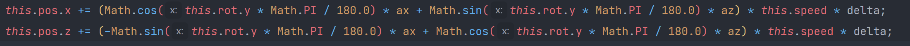

```javascript
this.pos.x += (Math.cos(this.rot.y * Math.PI / 180.0) * ax + Math.sin(this.rot.y * Math.PI / 180.0) * az) * this.speed * delta;
this.pos.z += (-Math.sin(this.rot.y * Math.PI / 180.0) * ax + Math.cos(this.rot.y * Math.PI / 180.0) * az) * this.speed * delta;
```

上式用来求得用户的横向位移和前后位移，求得的pos后面要用来构造translate也就是位置变换矩阵，这里需要将用户在自己坐标系下的位移转换为用户在世界坐标系下的位移，也就是上式。

最后根据用户当前的角度和当前的位置分别调用矩阵的rotate方法和translate方法得到转移矩阵。

## OpenGl摄像机


- 摄像机设置

  首先定义摄像机的位置

  ~~~c++
  glm::vec3 cameraPos = glm::vec3(0.0f, 0.0f, 3.0f);
  ~~~

  而后定义摄像机指向的方向

  ~~~c++
  glm::vec3 cameraTarget = glm::vec3(0.0f, 0.0f, 0.0f); 
  glm::vec3 cameraDirection = glm::normalize(cameraPos - cameraTarget);
  ~~~

  定义右向量，也就是摄像机空间的x轴正方向，获取方法是先定义上向量（指向y轴正方向的向量），再和方向向量叉乘

  ~~~c++
  glm::vec3 up = glm::vec3(0.0f, 1.0f, 0.0f);
  glm::vec3 cameraRight = glm::normalize(glm::cross(up, cameraDirection));
  ~~~

  定义上向量，摄像机空间的y轴正方向

  ~~~c++
  glm::vec3 cameraUp = glm::cross(cameraDirection, cameraRight);
  ~~~

  通过三个向量可以定义LookAt矩阵：用这3个轴外加一个平移向量来创建一个矩阵，并且你可以用这个矩阵乘以任何向量来将其变换到那个坐标空间。使用时将LookAt对应的矩阵传入着色器

  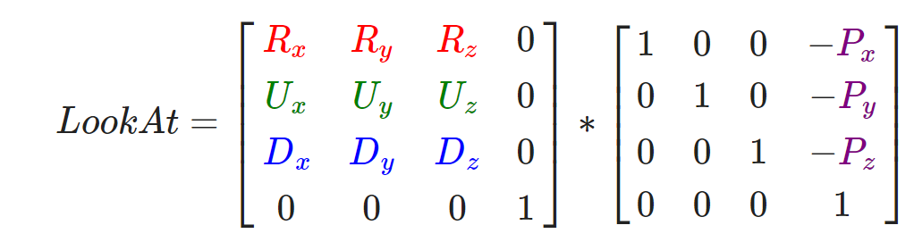

  其中R是右向量，U是上向量，D是方向向量P是摄像机位置向量。位置向量是相反的，因为我们最终希望把世界平移到与我们自身移动的相反方向。

  代码：

  ~~~c++
  glm::mat4 view; 
  view = glm::lookAt(glm::vec3(0.0f, 0.0f, 3.0f),glm::vec3(0.0f, 0.0f, 0.0f),       glm::vec3(0.0f, 1.0f, 0.0f));
  ~~~

  传给着色器

  

- 视角移动

  使用俯仰角和偏航角：俯仰角是描述我们如何往上或往下看的角，偏航角表示我们往左和往右看的程度

  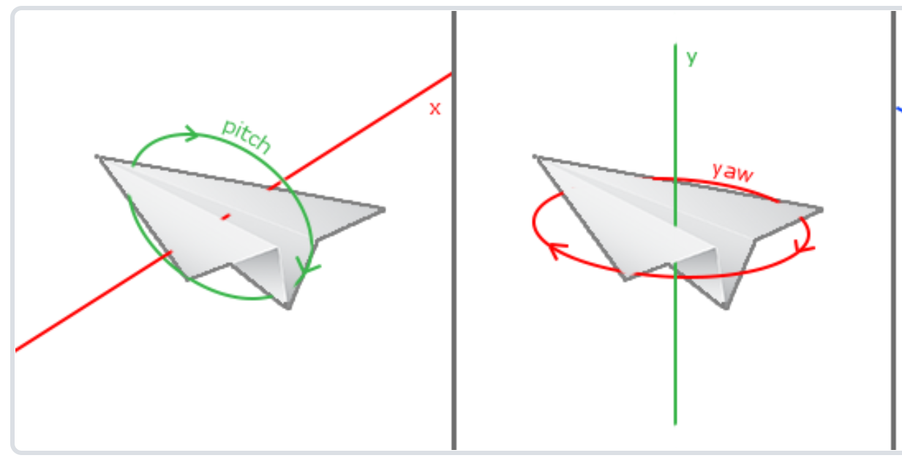

  首先需要获取鼠标的偏移，并将其加到角度上 

  ~~~c++
  yaw   += xoffset;
  pitch += yoffset;
  ~~~

  通过两个角计算方向向量

  ~~~c++
  glm::vec3 front;
  front.x = cos(glm::radians(pitch)) * cos(glm::radians(yaw));
  front.y = sin(glm::radians(pitch));
  front.z = cos(glm::radians(pitch)) * sin(glm::radians(yaw));
  cameraFront = glm::normalize(front);
  ~~~

  这就是当前鼠标指向的方向也就是摄像机的方向向量，这一向量的变化会反映到LookAt矩阵中，也就影响了我们的视角


## 变换矩阵

三维几何变换


摄像机情况下的矩阵:

正轴测投影屏幕

推导：
$$
Ry=\left[
 \begin{matrix}
   cosY & 0 & sinY & 0 \\
   0 & 1 & 0 & 0 \\
   -sinY & 0 & cosY & 0\\
   0&0&0&1
  \end{matrix}
  \right]\\
  Rx=\left[
 \begin{matrix}
   1 & 0 & 0 & 0 \\
   0 & cosX & -sinX & 0 \\
   0 & sinX & cosX & 0\\
   0&0&0&1
  \end{matrix}
  \right]\\
  R=RxRy=\left[
 \begin{matrix}
   cosY & 0 & sinY & 0 \\
   sinXsinY & cosX & -sinXcosY & 0 \\
   -cosXsinY & sinX & cosXcosY & 0\\
   0&0&0&1
  \end{matrix}
  \right]
$$
Ry为物体绕y轴的变换矩阵，而Rx为物体绕x轴的变换矩阵，两者相乘就得到了物体绕y轴旋转一个角度同时绕x轴旋转一个角度的变换矩阵。

对应到项目中，Y就是物体绕y轴旋转的角度，也就是横向转动的角度，因此由qe键和鼠标共同控制

```javascript
constructor()
    {
        this.m00 = 1; this.m01 = 0; this.m02 = 0; this.m03 = 0;
        this.m10 = 0; this.m11 = 1; this.m12 = 0; this.m13 = 0;
        this.m20 = 0; this.m21 = 0; this.m22 = 1; this.m23 = 0;
        this.m30 = 0; this.m31 = 0; this.m32 = 0; this.m33 = 1;
    }
```

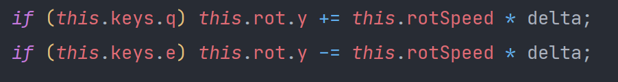

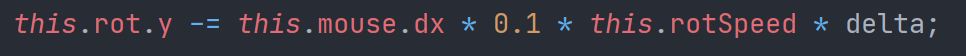

而X为物体绕x轴旋转的角度，也就是纵向转动的角度，只受到鼠标的控制

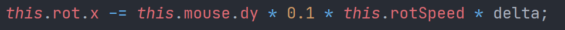

总结：rotate函数的设计就是延轴旋转，三个参数xyz分别是延三个轴旋转的角度，在摄像机类中，只沿着x和y旋转，所以这两个传入参数，而z恒为0

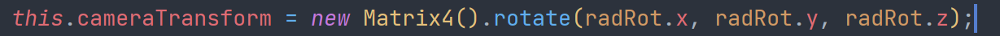

在光的控制中，光只沿着y旋转，所以只有y传入，其他两个为0

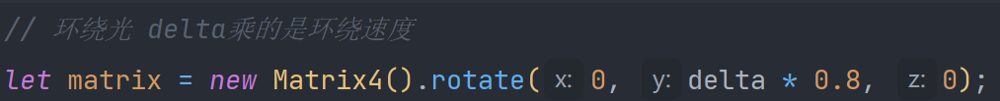

**需要考虑旋转的方向避免被提问**


## opengl变换矩阵

- 使用glm设置变换矩阵

旋转：逆时针旋转90度：

~~~c++
glm::mat4 trans; 
trans = glm::rotate(trans, glm::radians(90.0f), glm::vec3(0.0, 0.0, 1.0)); 
~~~

进行缩放：缩放0.5倍

~~~c++
trans = glm::scale(trans, glm::vec3(0.5, 0.5, 0.5));
~~~


- 变换矩阵组成：模型矩阵、观察矩阵和投影矩阵

$$
V=M_{projection}*M_{view}*M_{model}*V_{local}
$$

也就是各个不同含义的变换矩阵相乘后，再乘需要被变换的点的坐标

具体代码：

~~~
//模型矩阵，绕x轴旋转一定角度
model = glm::rotate(model, glm::radians(-55.0f), glm::vec3(1.0f, 0.0f, 0.0f));
//观察矩阵，控制位置的移动
view = glm::translate(view, glm::vec3(0.0f, 0.0f, -3.0f));
//投影矩阵
projection = glm::perspective(glm::radians(45.0f), screenWidth / screenHeight, 0.1f, 100.0f);

~~~

- ZBuffer（深度缓冲）

  判断在z方向被阻挡的物体不再出现，如果当前的片段在其它片段之后，它将会被丢弃，否则将会覆盖，也就是深度测试

  开启：

  ~~~
  glEnable(GL_DEPTH_TEST);
  ~~~


## 光

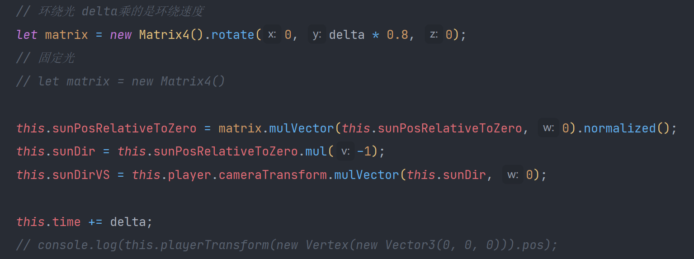


```javascript
let color = this.sample(x, y);
const toLight = this.sunDirVS.mul(-1).normalized();
let diffuse = toLight.dot(pixelNormal) * this.sunIntensity;
diffuse = Util.clamp(diffuse, this.ambient, 1.0);
if (this.specularIntensity != undefined)
{
	const toView = pixelPos.mul(-1).normalized();
	const halfway = toLight.add(toView).normalized();
	let specular = Math.pow(Math.max(pixelNormal.dot(halfway), 0), this.specularIntensity);
}

color = Util.mulColor(color, diffuse);
```


首先获得光的位置，matrix相当于一个旋转矩阵，让光旋转对应的角度，用旋转矩阵乘上光的当前位置（三维向量）得到了光的新位置（相对于世界坐标），之后乘-1，得到光的方向，再用相机的转换矩阵进行乘法得到在用户坐标下光的方向。

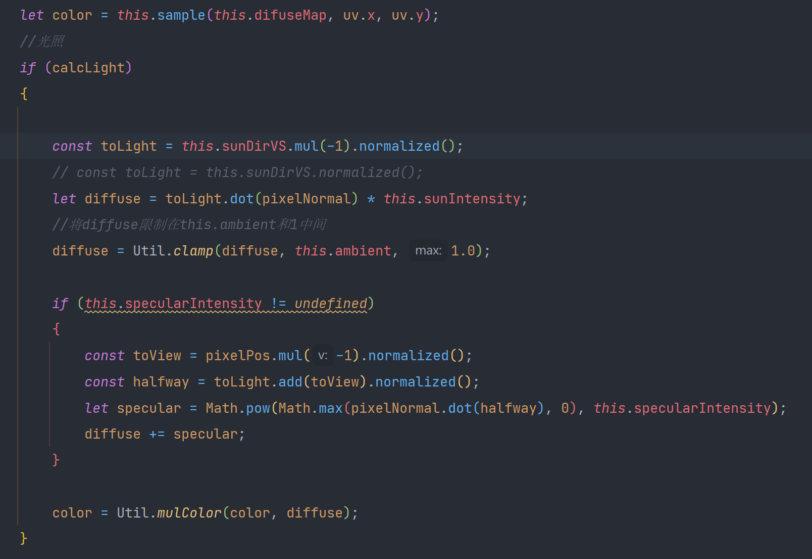

第一步tolight意思是从摄像机到光源的方向

第二行求法向量和光照方向的点乘，也就是光照方向在法向量方向的投影长度，也就是光射在这个面上的多少，然后乘上光强。

第三行的clamp是为了显示亮度，设置在0.2到1，这样光照很弱的地方不至于看不见，光照特别多的地方也不至于太亮。（如果去掉可能出现闪亮和纯黑的地方），diffuse相当于是亮度

下面的if是对镜面反射的处理，

首先获取toview，也就是从物体到摄像机的方向，将它和tolight相加，得到的halfway是两者的中间方向也就是中线方向，之后取法线在中线上的投影长度，如果大于0就通过将这个投影长度1000加到亮度中作为反射，小于0则没有反射

mulcolor通过传入的像素信息和光照信息，计算rgb

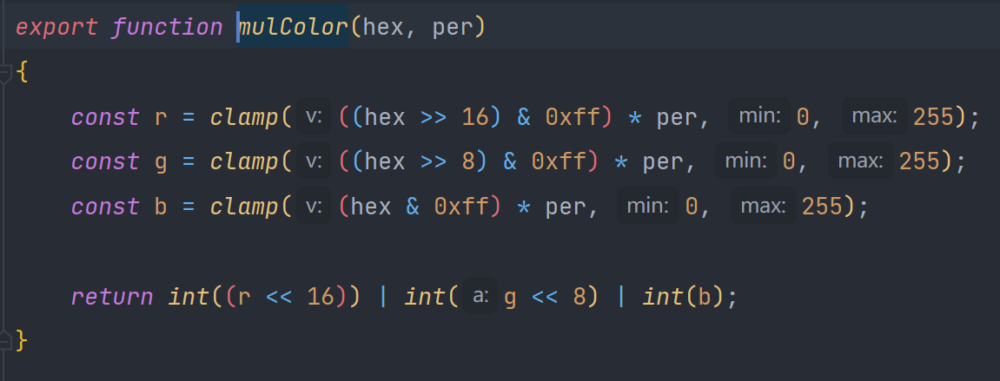


#### opengl光照

- 光照类别

  - 环境光照

    使用一个很小的常量作为环境光照，添加到物体片段的最终颜色中，即便场景中没有直接的光源也能看起来存在有一些发散的光。实现方法为：用光的颜色乘以一个很小的常量环境因子，再乘以物体的颜色，然后将最终结果作为片段的颜色，片段着色器入下：

    ```c++
    void main()
    {
        float ambientStrength = 0.1;
        vec3 ambient = ambientStrength * lightColor;
    
        vec3 result = ambient * objectColor;
        FragColor = vec4(result, 1.0);
    }
    ```

  - 漫反射光照

    计算漫反射光照，需要物体表面法向量***N***和光照入射向量***I***，当两个向量的夹角为90度的时候，点乘会变为0。所以当两向量夹角越大时，光对片段颜色的影响就越小。

    ```c++
    vec3 norm = normalize(Normal);
    vec3 lightDir = normalize(lightPos - FragPos);
    ```

    向量计算。

    ```c++
    float diff = max(dot(norm, lightDir), 0.0);
    vec3 diffuse = diff * lightColor;
    ```

    片段着色器中，通过点乘计算出漫反射光照强度

  - 镜面光照

    镜面光照依据光的观察方向向量和物体的法向量来决定的，即用户从什么方向看这个片段。通过反射法向量周围光的方向来计算反射向量。然后计算反射向量和视线方向的角度差，如果夹角越小，那么镜面光的影响就会越大。

    ```c++
    vec3 viewDir = normalize(viewPos - FragPos);
    vec3 reflectDir = reflect(-lightDir, norm);
    ```

    计算视角方向和反射光方向

    ```c++
    float spec = pow(max(dot(viewDir, reflectDir), 0.0), 32);
    vec3 specular = specularStrength * spec * lightColor;
    ```

    计算镜面反射关照向量

  - 综合光照

    ```c++
    vec3 result = (ambient + diffuse + specular) * objectColor;
    FragColor = vec4(result, 1.0);
    ```

    我们将三种类型的关照相加得到综合关照向量，再乘以物体自身的颜色，得到物体发射的光的颜色。

- 材质

  物体反射光的效果与物体表面的材质有很大关系，所以在结合三种关照类型和物体表面颜色的影响之后，我们还需要考虑物体表面材质的因素。

  - 物体材质

    我们在片段着色器中定义Material结构体来表示物体的材质。

    ```c++
    struct Material {
        vec3 ambient;
        vec3 diffuse;
        vec3 specular;
        float shininess;
    }; 
    ```

    分别表示物体在接受不同类型的光照时自身对反射光造成的影响。

    ```c++
    lightingShader.setVec3("material.ambient",  1.0f, 0.5f, 0.31f);
    ```

    如上，通过uniform为物体材质的各个分量进行赋值。

    ```c++
    vec3 ambient = lightColor * material.ambient;
    ```

    之后，在片段着色器中计算每一种反射光照时，都应该乘上对应的物体材质，来反映物体材质对反射光照的影响。最后在将三种类型的光照进行综合，得到最终的反射光。下图的各个分量均乘上了对应的物体材质属性。

    ```c++
    vec3 result = ambient + diffuse + specular;
    ```

- 投光物

  - 平行光

    ```c++
    struct Light {
        vec3 direction;
        vec3 ambient;
        vec3 diffuse;
        vec3 specular;
    };
    ```

    平行光除去三个基本属性外，需要增加光照方向属性

  - 点光源

    ```c++
    vec3 position; 
    float constant;
    float linear;
    float quadratic;
    ```

    点光源在平行光的基础上，需要设置光源位置、光照常数项、一次项以及二次项（用于表现光照强度随距离的变化），因为点光源对物体的光照强度会随距离增大而衰减。衰减公式如下

    ```c++
    float distance = length(light.position - FragPos);
    float attenuation = 1.0 / (light.constant + light.linear * distance + 
                    light.quadratic * (distance * distance));
    ```

  - 聚光

    用于表现手电等类似物体的光照。在片段着色器中，我们需要记录聚光的位置向量（来计算光的方向向量）、聚光的方向向量和一个切光角。将它们存放在结构体中。

    ```c++
    vec3  position;
    vec3  direction;
    float cutOff;
    ```

  - 同样，我们针对每一种光源都能计算出对应的光照的三个分量，并以此结合物体的材质计算出反射光。

- 多光源

  考虑多个光源，我们可以将任意数量的平行光、点光源与聚光放入环境，统一计算物体的反射光。对此只需要对物体片段着色器进行一些改动

  ```c++
  // 第一阶段：定向光照
      vec3 result = CalcDirLight(dirLight, norm, viewDir);
      // 第二阶段：点光源
      for(int i = 0; i < NR_POINT_LIGHTS; i++)
          result += CalcPointLight(pointLights[i], norm, FragPos, viewDir);    
      // 第三阶段：聚光
      result += CalcSpotLight(spotLight, norm, FragPos, viewDir);    
      FragColor = vec4(result, 1.0);
  ```

  如图，在片段着色器中，我们用数组来存储多个光源的信息。在主程序中，我们定义多个光照，并通过uniform将作用于物体的光照的属性全部传入到片段着色器中保存。在计算物体反射光时，我们只需要调用片段着色器，并使用循环将所有光源产生的所有光照分量进行分别叠加，即可得到最终的光照。同样，再结合物体自身的材质，就可计算出物体的反射光。


### 高级OpenGL

#### 深度测试

使用深度缓冲来防止3D为物体面的前后关系错乱。深度缓冲会存储每个片段的信息，以16、24或32位float的形式储存它的深度值。深度测试被启用时，OpenGL会将一个片段的深度值与深度缓冲中的内容进行比较，取较大值，并对深度缓冲进行更新，较小值（片段）被丢弃。具体体现为：每个片段的深度值都位于[0,1]范围之中（或者被线性变换到[0,1]之间），系统通过比较深度缓冲中深度值的大小和物体z值大小来判断片段的远近，并更新深度缓冲。

- ```c++
  glEnable(GL_DEPTH_TEST)
  ```

  启用深度测试，启用后会对每一个片段的深度进行比较，并取较大值进行更新，较小值丢弃。

- ```C++
  glClear(GL_COLOR_BUFFER_BIT | GL_DEPTH_BUFFER_BIT)
  ```

  清空深度缓冲。在每一轮渲染之前应该清空深度缓冲进行更新。

- ```C++
  glDepthFunc(GL_LESS);
  ```

  深度测试函数，用于是我们能够控制何时通过或丢弃片段，何时取更新深度缓冲。

- 深度冲突：当物体靠的过近时，由于深度测试，会表现出视野中紧贴的两个面不断切换的情况。应该避免两个物体的面重合。

#### 混合

混合用于实现物体的透明度，例如透过一块红色的玻璃去观察后面的物体，此时物体的颜色就为红色与它原本颜色的混合色。

- alpha值：Alpha颜色值是颜色向量的第四个分量。1.0时物体完全不透明，0.0时物体将会是完全透明的。当alpha值为0.5时，物体的颜色有50%是来自物体自身的颜色，50%来自背后物体的颜色。

- ```C++
  glTexImage2D(GL_TEXTURE_2D, 0, GL_RGBA, width, height, 0, GL_RGBA, GL_UNSIGNED_BYTE, data);
  ```

  此函数中在纹理加载时使用了alpha通道，用于之后设置透明度。

- ```c++
  void main()
  {             
      vec4 texColor = texture(texture1, TexCoords);
      if(texColor.a < 0.1)
          discard;
      FragColor = texColor;
  }
  ```

  加载物体纹理时，需要在片段着色器中对alpha通道的值进行判断。当采样的纹理颜色小于0.1时，丢弃该片段，以此实现只显示想要的部分纹理，而其余部分透明。

- ```C++
  glEnable(GL_BLEND)
  ```

  启用颜色混合

- ```c++
  glBlendFunc(GL_SRC_ALPHA, GL_ONE_MINUS_SRC_ALPHA)
  ```

  颜色混合函数。第一项为第一个物体颜色的alpha通道值，第二项为另一个物体颜色的alpha通道值，二者和为1。即此函数设置了物体颜色混合时每部分的占比。

- 在使用**混合**时要注意**深度测试**（一般情况时应该从远到近依次渲染），否则深度测试会优先执行，在设置物体透明度后，还是会因为深度测试看不到后面的物体。

#### 面剔除

```c++
glEnable(GL_CULL_FACE);
```

启用面剔除，检查所有面向观察者的面进行渲染，丢弃那些背向的面，节省片段着色器调用开销。

- 方法：检测顶点环绕顺序。我们首先为三角形的顶点标号（1，2，3），以设置环绕顺序。当检测到观察者视角中该面中的点为顺时针环绕时，判断为正面并进行渲染；检测到为逆时针时，判断为背面并丢弃。

#### 立方体贴图

立方体贴图是一个包含了6个2D纹理的纹理，每个2D纹理都组成了立方体的一个面，是一张完整的纹理。

 ```c++
  unsigned int textureID;
  glGenTextures(1, &textureID);
  glBindTexture(GL_TEXTURE_CUBE_MAP, textureID);
 ```

  定义一个表示纹理ID的变量，并生成一个纹理，通过**glBindTexture**将纹理绑定到目标上

**天空盒**

  天空盒贴图与一般的立方体贴图相同，但需要注意天空盒包裹在最外层，所以应该移除该立方体的全部位移。

  ```c++
  glm::mat4 view = glm::mat4(glm::mat3(camera.GetViewMatrix()))
  ```

  我们通过取4x4矩阵左上角的3x3矩阵来移除变换矩阵的位移部分，我们可以将观察矩阵转换为3x3矩阵（移除位移），再将其转换回4x4矩阵。通过以上代码，我们只保留了天空盒的旋转变换，实现了天空盒效果。

 **环境映射**

  **反射**

    根据观察方向向量***I***和物体的法向量***N***，来计算反射向量***R***。我们使用GLSL内建的**reflect**函数来计算这个反射向量。我们以***R***向量作为索引向量来对天空盒贴图进行采样，返回环境的颜色值。最终的结果是物体看起来反射了天空盒。片段着色器部分入下：

```c++
void main()
{             
    vec3 I = normalize(Position - cameraPos);
    vec3 R = reflect(I, normalize(Normal));
    FragColor = vec4(texture(skybox, R).rgb, 1.0);
}
```

 折射
    
根据观察方向向量***I***和物体的法向量***N***，来计算反射向量***R‘***，我们使用GLSL内建的**refract**函数来计算这个折射向量。后续取样操作与反射贴图相同。

```c++
void main()
{             
    float ratio = 1.00 / 1.52;
    vec3 I = normalize(Position - cameraPos);
    vec3 R = refract(I, normalize(Normal), ratio);
    FragColor = vec4(texture(skybox, R).rgb, 1.0);
}
```


呈现在屏幕上

opengl 着色器


世界坐标

经过变换（camera + 本身的变换）

三维转化成二维度

分成几等份

// 将三个点的坐标转换成实际屏幕像素闪光 除以z相当于一个投影矩阵 对应opengl 加减width/2是因为坐标系统中间为0 然而画图的时候左侧为0起始

```javascript
const p0 = new vector_2(
    position.x / position.z * pixel_num + WIDTH / 2.0, 
    position.y / position.z * pixel_num + HEIGHT / 2.0);
```


图形 模型 obj assimp

当使用Assimp库导入一个模型的时候，它会将整个模型加载进一个**场景(Scene)**对象，它包含导入的模型/场景中的所有数据。Assimp会将场景载入为一系列的**节点(Node)**，每个节点包含了场景对象中所储存数据的索引，每个节点都可以有任意数量的子节点。

这些节点有一系列指向**场景**对象中mMeshes数组中储存的网格数据的索引。Scene下的mMeshes数组储存了**真正的Mesh对象**。

一个Mesh对象本身包含了渲染所需要的所有相关数据，像是顶点位置、法向量、纹理坐标、面(Face)和物体的材质。分别对这些**Mesh对象**进行渲染，最终得到一系列的网格数据，将它们包含在一个**Model对象**中，即完成了对象导入。


扫描线填充

为什么用


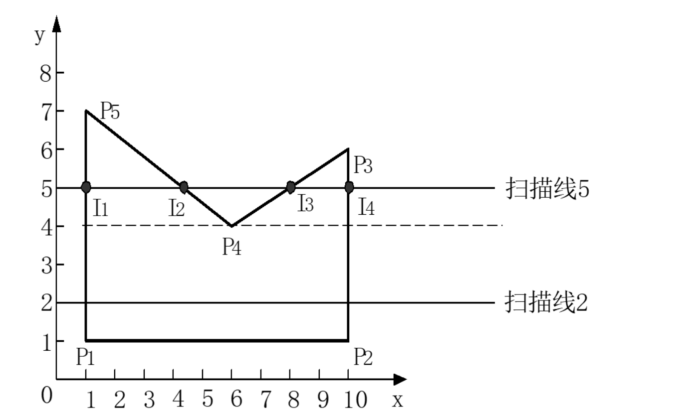


判断在面内

象限法在方法介绍上虽说是判别每条边对应该点的单位圆上面的弧度之和，但是其实质是以所判断点建立直角坐标系，判断多边形的每个边的变化象限范围，依次将变化值求和来根据最后的值来判断点和多边形的相对位置。

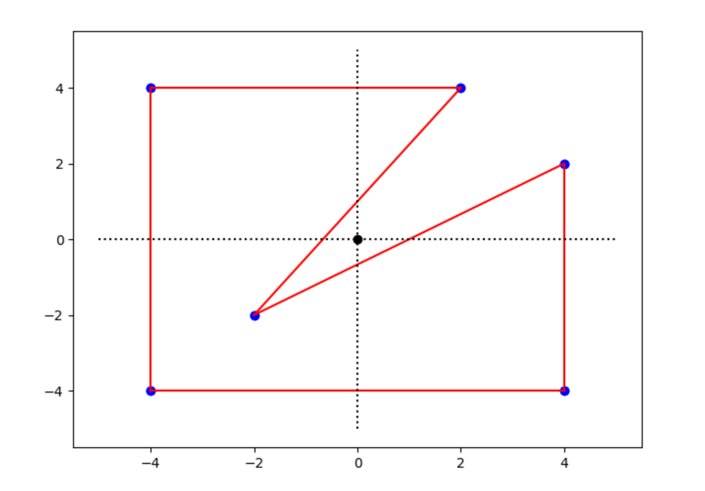


射线法

通过判断射线穿过多边形边的次数的奇偶去判断点在多边形内还是外。其实质思想是，任意一条直线穿过多边形的次数一定为偶数次（假设不过顶点），那么射线穿多边形的次数的奇偶仅仅取决于第一次穿过多边形为穿入or穿出。入偶出奇。

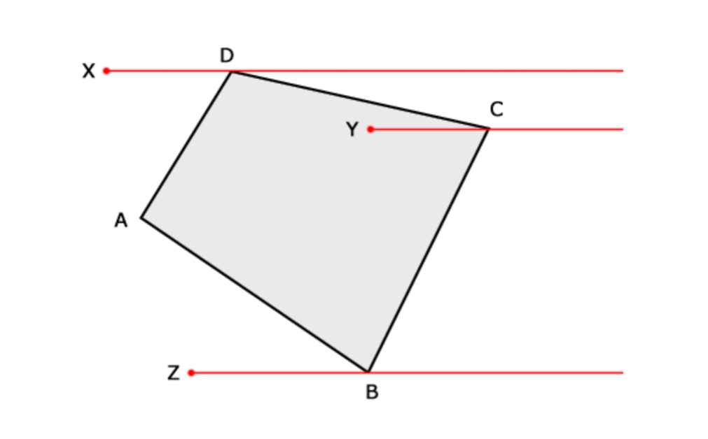


cross 判断是否在同侧180

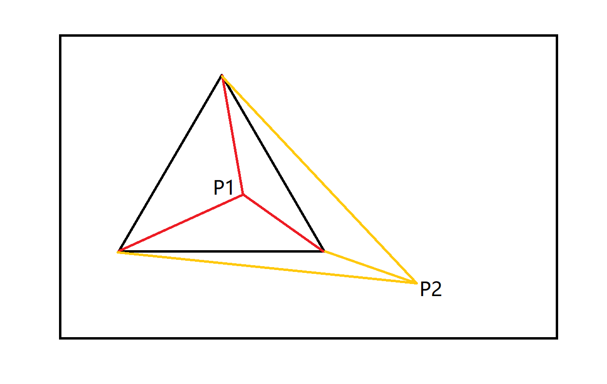


