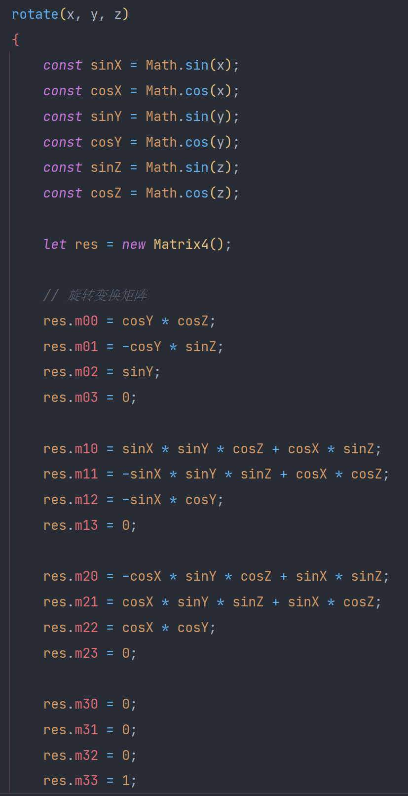

## 摄像机类

属性：键盘和鼠标，移动速度和旋转速度，位置和角度，摄像机变换矩阵，在view中显示物体用

使用：

类包含一个update方法，每过固定的时间就会被调用。

键盘和鼠标中记录了当前时刻用户的输入，比如asd这些键是否被按下等等，通过这些信息，改变位置向量和角度向量。当用户输入wasd时，位置向量进行更改（速度乘时间），当用户鼠标移动或者按下qe时，角度向量进行更改

上式用来求得用户的横向位移和前后位移，求得的pos后面要用来构造translate也就是位置变换矩阵，这里需要将用户在自己坐标系下的位移转换为用户在世界坐标系下的位移，也就是上式。

最后根据用户当前的角度和当前的位置分别调用矩阵的rotate方法和translate方法得到转移矩阵。

## 变换矩阵

摄像机情况下的矩阵:

推导：
$$
Ry=\left[
 \begin{matrix}
   cosY & 0 & sinY & 0 \\
   0 & 1 & 0 & 0 \\
   -sinY & 0 & cosY & 0\\
   0&0&0&1
  \end{matrix}
  \right]\\
  Rx=\left[
 \begin{matrix}
   1 & 0 & 0 & 0 \\
   0 & cosX & -sinX & 0 \\
   0 & sinX & cosX & 0\\
   0&0&0&1
  \end{matrix}
  \right]\\
  R=RxRy=\left[
 \begin{matrix}
   cosY & 0 & sinY & 0 \\
   sinXsinY & cosX & -sinXcosY & 0 \\
   -cosXsinY & sinX & cosXcosY & 0\\
   0&0&0&1
  \end{matrix}
  \right]
$$
Ry为物体绕y轴的变换矩阵，而Rx为物体绕x轴的变换矩阵，两者相乘就得到了物体绕y轴旋转一个角度同时绕x轴旋转一个角度的变换矩阵。

对应到项目中，Y就是物体绕y轴旋转的角度，也就是横向转动的角度，因此由qe键和鼠标共同控制

而X为物体绕x轴旋转的角度，也就是纵向转动的角度，只受到鼠标的控制

总结：rotate函数的设计就是延轴旋转，三个参数xyz分别是延三个轴旋转的角度，在摄像机类中，只沿着x和y旋转，所以这两个传入参数，而z恒为0

在光的控制中，光只沿着y旋转，所以只有y传入，其他两个为0

**需要考虑旋转的方向避免被提问**

## 光

首先获得光的位置，matrix相当于一个旋转矩阵，让光旋转对应的角度，用旋转矩阵乘上光的当前位置（三维向量）得到了光的新位置（相对于世界坐标），之后乘-1，得到光的方向，再用相机的转换矩阵进行乘法得到在用户坐标下光的方向。

第一步tolight意思是从摄像机到光源的方向

第二行求法向量和光照方向的点乘，也就是光照方向在法向量方向的投影长度，也就是光射在这个面上的多少，然后乘上光强。

第三行的clamp是为了显示亮度，设置在0.2到1，这样光照很弱的地方不至于看不见，光照特别多的地方也不至于太亮。（如果去掉可能出现闪亮和纯黑的地方），diffuse相当于是亮度

下面的if是对镜面反射的处理，

首先获取toview，也就是从物体到摄像机的方向，将它和tolight相加，得到的halfway是两者的中间方向也就是中线方向，之后取法线在中线上的投影长度，如果大于0就通过将这个投影长度1000加到亮度中作为反射，小于0则没有反射

mulcolor通过传入的像素信息和光照信息，计算rgb

## OpenGl摄像机

- 使用glm设置变换矩阵

旋转：逆时针旋转90度：

~~~c++
glm::mat4 trans; 
trans = glm::rotate(trans, glm::radians(90.0f), glm::vec3(0.0, 0.0, 1.0)); 
~~~

进行缩放：缩放0.5倍

~~~c++
trans = glm::scale(trans, glm::vec3(0.5, 0.5, 0.5));
~~~

- 变换矩阵组成：模型矩阵、观察矩阵和投影矩阵

$$
V=M_{projection}*M_{view}*M_{model}*V_{local}
$$

也就是各个不同含义的变换矩阵相乘后，再乘需要被变换的点的坐标

具体代码：

~~~
//模型矩阵，绕x轴旋转一定角度
model = glm::rotate(model, glm::radians(-55.0f), glm::vec3(1.0f, 0.0f, 0.0f));
//观察矩阵，控制位置的移动
view = glm::translate(view, glm::vec3(0.0f, 0.0f, -3.0f));
//投影矩阵
projection = glm::perspective(glm::radians(45.0f), screenWidth / screenHeight, 0.1f, 100.0f);

~~~

- ZBuffer（深度缓冲）

  判断在z方向被阻挡的物体不再出现，如果当前的片段在其它片段之后，它将会被丢弃，否则将会覆盖，也就是深度测试

  开启：

  ~~~
  glEnable(GL_DEPTH_TEST);
  ~~~

  

- 摄像机设置

  首先定义摄像机的位置

  ~~~
  glm::vec3 cameraPos = glm::vec3(0.0f, 0.0f, 3.0f);
  ~~~

  而后定义摄像机指向的方向

  ~~~
  glm::vec3 cameraTarget = glm::vec3(0.0f, 0.0f, 0.0f); 
  glm::vec3 cameraDirection = glm::normalize(cameraPos - cameraTarget);
  ~~~

  定义右向量，也就是摄像机空间的x轴正方向，获取方法是先定义上向量（指向y轴正方向的向量），再和方向向量叉乘

  ~~~
  glm::vec3 up = glm::vec3(0.0f, 1.0f, 0.0f);
  glm::vec3 cameraRight = glm::normalize(glm::cross(up, cameraDirection));
  ~~~

  定义上向量，摄像机空间的y轴正方向

  ~~~
  glm::vec3 cameraUp = glm::cross(cameraDirection, cameraRight);
  ~~~

  通过三个向量可以定义LookAt矩阵：用这3个轴外加一个平移向量来创建一个矩阵，并且你可以用这个矩阵乘以任何向量来将其变换到那个坐标空间。使用时将LookAt对应的矩阵传入着色器

  

  其中R是右向量，U是上向量，D是方向向量P是摄像机位置向量。位置向量是相反的，因为我们最终希望把世界平移到与我们自身移动的相反方向。

  代码：

  ~~~
  glm::mat4 view; 
  view = glm::lookAt(glm::vec3(0.0f, 0.0f, 3.0f),glm::vec3(0.0f, 0.0f, 0.0f),       glm::vec3(0.0f, 1.0f, 0.0f));
  ~~~

  

- 视角移动

  使用俯仰角和偏航角：俯仰角是描述我们如何往上或往下看的角，偏航角表示我们往左和往右看的程度

  

  首先需要获取鼠标的偏移，并将其加到角度上

  ~~~
  yaw   += xoffset;
  pitch += yoffset;
  ~~~

  通过两个角计算方向向量

  ~~~
  glm::vec3 front;
  front.x = cos(glm::radians(pitch)) * cos(glm::radians(yaw));
  front.y = sin(glm::radians(pitch));
  front.z = cos(glm::radians(pitch)) * sin(glm::radians(yaw));
  cameraFront = glm::normalize(front);
  ~~~

  这就是当前鼠标指向的方向也就是摄像机的方向向量，这一向量的变化会反映到LookAt矩阵中，也就影响了我们的视角
